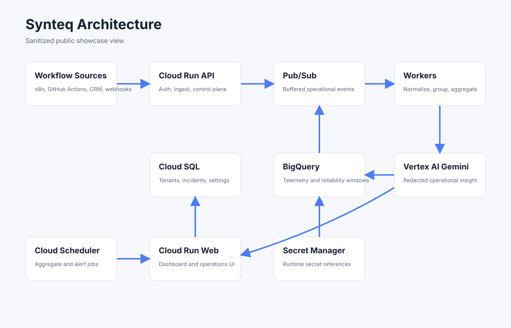

# Synteq Showcase

Synteq is an early-stage workflow reliability intelligence platform. It gives teams operational awareness for workflow execution signals without trying to replace logs, traces, APM, or general-purpose observability tools.

This repository is a sanitized public showcase. It contains architecture notes, synthetic examples, selected implementation patterns, and product visuals. It does not contain production code, credentials, customer data, private runbooks, production URLs, or infrastructure identifiers.

## What Problem Does Synteq Solve?

Revenue, onboarding, support, and fulfillment processes increasingly depend on workflow automation. When those workflows fail, time out, retry unexpectedly, or stop sending signals, teams often reconstruct the problem from disconnected vendor logs.

Synteq helps operators answer:

- Which workflow sources are sending signals?
- Are those signals fresh, stale, or not yet available?
- Which workflows are failing or slowing down?
- Is a failure isolated or part of an incident pattern?
- What operational context should the team inspect next?

## How It Works

```text
Choose source
-> Configure webhook or API key
-> Send first event
-> Synteq validates and normalizes the signal
-> Source freshness and reliability windows update
-> Related failures gain incident and timeline context
-> Teams gain operational awareness
```

Synteq accepts workflow execution signals, associates them with a tenant-owned source, normalizes provider-specific payloads, and updates tenant-scoped operational views. Real signal history is tracked separately from test, simulation, and demo activity.

## Current Capabilities

Implemented capabilities include:

- Workflow signal ingestion for execution, heartbeat, and normalized operational events.
- Generic webhook and API-key sources for n8n, Make, Zapier, and custom workflow systems.
- GitHub Actions workflow and job signal support through signed webhooks.
- Tenant and source ownership validation at ingestion boundaries.
- Signal normalization into a shared operational event shape.
- Source inventory, source freshness visibility, and activation guidance.
- Operational dashboards and 1-hour, 24-hour, and 7-day reliability windows.
- Incident lifecycle, grouping foundations, attention views, and sanitized timelines.
- Alert policies, channels, and dispatch foundations where runtime delivery is configured.
- Durable workspace and source signal state.
- Canonical workspace maturity states: `new`, `configuring`, `active`, `degraded`, `demo_preview`, and `unknown`.
- Read-only source readiness checks and explicitly marked test/simulation flows.

Current incident guidance is deterministic and rules-based. Synteq does not currently claim production AI root-cause analysis, autonomous remediation, native provider OAuth, scheduled synthetic monitoring, or enterprise compliance certification.

## Architecture



The public-safe architecture separates:

- Source setup and authenticated ingestion.
- Validation, ownership checks, and signal normalization.
- Transactional source, signal-state, incident, and control-plane records.
- Analytical execution telemetry and reliability windows.
- Incident and timeline context.
- Operator-facing dashboard, source, and alerting surfaces.

See [docs/architecture.md](docs/architecture.md) and [docs/data-flow.md](docs/data-flow.md) for more detail.

## Technology Themes

- TypeScript, Node.js, Fastify, Next.js, React, and Prisma.
- Relational application state and analytical telemetry storage.
- Optional queued ingestion for burst handling.
- HMAC and provider-native webhook verification patterns.
- Tenant isolation, source ownership enforcement, idempotency, and payload sanitization.

The showcase intentionally describes architecture at a high level and omits deployable production infrastructure.

## Current Status

Synteq is currently an early-stage workflow reliability intelligence platform under active development. The platform supports controlled demos and ongoing design validation while operational workflows continue to mature.

The canonical workspace maturity foundation is implemented. Product experiences do not yet switch automatically between onboarding and established-workspace Home views based on that state.

## Public-Safe Roadmap

Near-term themes:

- Validate canonical maturity behavior with controlled workspace histories.
- Improve source identity and freshness clarity across product surfaces.
- Expand workflow-specific reliability context and release-smoke coverage.
- Continue incident, timeline, alerting, and demo stability improvements.
- Evaluate native provider integrations and SLO-oriented features only after core reliability workflows are proven.

## Repository Contents

- `assets`: sanitized architecture and product mockups.
- `docs`: public-safe architecture, data-flow, deployment, security, and review notes.
- `examples`: synthetic event, incident, reliability, and webhook examples.
- `src-samples`: limited sample normalization, scoring, grouping, and validation patterns.

## What Is Excluded

- Production source code and proprietary business logic.
- Credentials, service-account files, API keys, tokens, webhook secrets, and database URLs.
- Customer data, private logs, internal runbooks, production URLs, and infrastructure state.
- Claims for capabilities that have not been implemented and verified.
